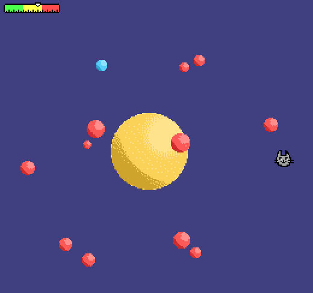

# Catatomic

Author: George Ralph

Design: I used a series of scaled spites and layer selections to give the illusion
of spheres orbiting around an object in 3D space.

Screen Shot:

How Your Asset Pipeline Works:

I draw art in Sprites.png with GIMP, and set the palette colors in Palette.png.
The palettes to use for each tile are stored as the R channel in Sprite_Palettes.png

Then, I use a python script to read in the tilemap and convert it into the binary
encoding of the sprites, which is read into my game. I use the loadPNG library to
load in my color palettes.

How To Play:

Use the arrow keys to navigate the cat around, and the space bar to grab a particle.
You need to push all 12 electrons into orbit around the nucleus without letting the
blue neutrons hit the nucleus and cause the atom to split!

Sources: 
Code for interacting with the file system to load assets (though not asset decoding) 
was largely inspired by similar code from a previous project in this class.
https://github.com/kjannakh/15-466-f20-base1

This game was built with [NEST](NEST.md).

